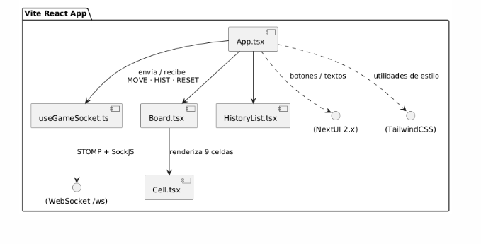

# ✨ Tic‑Tac‑Toe NextUI v2 + Tailwind + React ✨

Un pequeño proyecto demo que implementa el clásico **Tres‑en‑raya** (Tic‑Tac‑Toe) con:

| Tecnologías     | Versión | Notas                                              |
|-----------------|---------|----------------------------------------------------|
| **React**       | 18.x    | Vite como *bundler* por defecto                    |
| **NextUI**      | 2.x     | Componentes UI minimalistas basados en TailwindCSS |
| **TailwindCSS** | 3.x     | Utilidad para estilos funcionales                  |
| **TypeScript**  | —       | Estrictamente tipado                               |
| **STOMP + SockJS** | —    | Comunicación WebSocket en tiempo real              |

---

## ✌️ Segunda entrega (v2)

En esta iteración añadimos **juego en tiempo real**:

| Cambio | Descripción |
|--------|-------------|
| WebSocket (`/ws`) | Conexión STOMP + SockJS que transmite `MOVE`, `HIST`, `RESET`. |
| Patrón *Relay*    | El backend solo re‑difunde mensajes; la lógica vive en el front. |
| Endpoint `GET /api/start` | Asigna símbolo alternado (`X` → `O`) al pulsar **Iniciar**. |
| Endpoint `POST /api/reset-symbols` | Libera los símbolos para nuevos jugadores. |
| Hook `useGameSocket.ts`   | Encapsula la lógica WebSocket, reconexión y helpers. |
| Historial sincrónico      | Ambos clientes ven y pueden retroceder jugadas en vivo. |
| Botones **Iniciar / Deshacer / Reiniciar** estilizados con NextUI + Tailwind. |

---

## 🚀 Instalación rápida

```bash
git clone https://github.com/tu-usuario/tictactoe-nextui.git
cd tictactoe-nextui

npm install        

npm run dev

npm run build
npm run preview
```

# Dependencias
npm install        

# Levantar servidor de desarrollo
npm run dev

# Construcción para producción
npm run build
npm run preview    


## 📜 Scripts disponibles

| Script   | Acción                                                   |
|----------|----------------------------------------------------------|
| `dev`    | Inicia Vite en modo desarrollo                           |
| `build`  | Genera `dist/` optimizado para producción                |
| `preview`| Sirve la build con un servidor estático local            |
| `lint`   | Linter / Prettier opcional (añádelo si lo necesitas)     |

---

## 🕹️ Cómo jugar

1. Abre **dos pestañas** en `http://localhost:5173`.
2. Cada jugador pulsa **Iniciar**: el primero recibe **X**, el segundo **O**.
3. Haz click en un cuadro vacío para colocar tu símbolo (turnos alternos).
4. **Deshacer** rebobina a la jugada anterior; **Reiniciar** limpia el tablero y libera los símbolos.
5. El mensaje inferior muestra turno, empate (🤝) o ganador (🏆).

> ¡Disfruta del juego en tiempo real! 🎮


